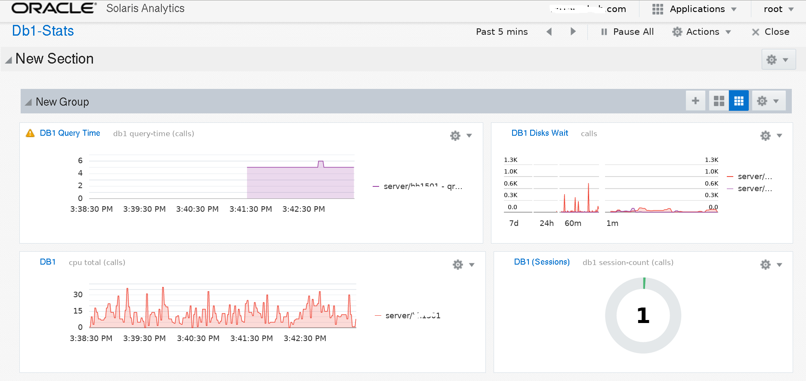

# solaris-analytics-publisher
Solaris Analytics Capture And Publisher

This repository contains Solaris 11.4+(12) Analytics Capture and Publisher sample code.
The sample code will help you getting quickly up and running, and possibly add your own statistics.

The sample application will extend the Solaris Stats Store Schema.
The list of stats are below.
<i>Note: </i> Two of the stats uses scripts to capture MySQL/DB related stats (below), feel free to add/remove your own stats.
<pre>
       "description": "date_time",
       "id": "//:class.app/company/servers//:stat.date_time",
       "description": "cpu usage sys",
       "id": "//:class.app/company/servers//:stat.cpu.usage-sys",
       "description": "cpu usage usr",
       "id": "//:class.app/company/servers//:stat.cpu.usage-usr",
       "description": "cpu total",
       "id": "//:class.app/company/servers//:stat.cpu.usage-total",
       "description": "memory total",
       "id": "//:class.app/company/servers//:stat.memory-total",
       "description": "memory used",
       "id": "//:class.app/company/servers//:stat.memory-used",
       "description": "swap total",
       "id": "//:class.app/company/servers//:stat.swap-total",
       "description": "swap used",
       "id": "//:class.app/company/servers//:stat.swap-used",
       "description": "net in megabytes",
       "id": "//:class.app/company/servers//:stat.net.in-megabytes",
       "description": "network out megabytes",
       "id": "//:class.app/company/servers//:stat.net.out-megabytes",
       "description": "disk read-megabytes (0B)",
       "id": "//:class.app/company/servers//:stat.disk.read-megabytes-0B",
       "description": "disk write-megabytes (0B)",
       "id": "//:class.app/company/servers//:stat.disk.write-megabytes-0B",
       "description": "disk read-ops (0B)",
       "id": "//:class.app/company/servers//:stat.disk.read-ops-0B",
       "description": "disk write-ops (0B)",
       "id": "//:class.app/company/servers//:stat.disk.write-ops-0B",
       "description": "disk read wait-time (0B)",
       "id": "//:class.app/company/servers//:stat.disk.read_wait-time-0B",
       "description": "disk write wait-time (0B)",
       "id": "//:class.app/company/servers//:stat.disk.write_wait-time-0B",
       "description": "disk read-megabytes (0C)",
       "id": "//:class.app/company/servers//:stat.disk.read-megabytes-0C",
       "description": "disk write-megabytes (0C)",
       "id": "//:class.app/company/servers//:stat.disk.write-megabytes-0C",
       "description": "disk read-ops (0C)",
       "id": "//:class.app/company/servers//:stat.disk.read-ops-0C",
       "description": "disk write-ops (0C)",
       "id": "//:class.app/company/servers//:stat.disk.write-ops-0C",
       "description": "disk read wait-time (0C)",
       "id": "//:class.app/company/servers//:stat.disk.read_wait-time-0C",
       "description": "disk write wait-time (0C)",
       "id": "//:class.app/company/servers//:stat.disk.write_wait-time-0C",
       "description": "db1 query-time",
       "id": "//:class.app/company/servers//:stat.db1.qry-time",
       "description": "db1 session-count",
       "id": "//:class.app/company/servers//:stat.db1.ses-count",
       "description": "db1 date generate",
       "id": "//:class.app/company/servers//:stat.db1.date_gen",
</pre>

<h4>Versions</h4>

<b>Version 0.2</b>

<b>Note: </b>This update significantly enhances Analytics collection on Solaris 11.4+(12).

<ul>
<li>Removed the need for an extra Python HTTP server to gather remote analytics (this is still needed for pre s11.4 clients).</li>
<li>Removed the need for a local SQLite Database (this is still needed for pre s11.4 clients).</li>
<li>Updated all REST API calls to use Solars Remote Administration Demon(RAD) Authentication.</li>
</ul>

The new version only needs one service/demon to run on the remote node. 
All data captured is stored in the local Stats Store. 
The remote Stats Store central server queries / pulls from all the remote client.

The install adds two new SMF services and two new Python applications.

To use the new version (preferred for Solaris 11.4+/12) follow the instructions below in the install section.

<b>Version 0.1</b>

Initial Release

<h3>Getting Started</h3>

<h4>Installation</h4>
<h4>Dependencies / Prerequisites</h4>
<b>The following Python libraries are required:</b>
<pre>
os,
sys,
time,
socket,
string,
json,
sqlite3,
threading,
subprocess,
multiprocessing,
psutil as ps,
from functools import partial,
from libsstore import SStore,
from multiprocessing import Process,
from pprint import pprint,
from urllib2 import Request, urlopen, URLError,
from urlparse import urlparse,

Solaris 11.4+(12)
import rad.auth as rada
import rad.client as radcli
import rad.connect as radcon
import rad.bindings.com.oracle.solaris.rad.sstore_1 as sstore
</pre>
<i>Note: </i>You can install libraries by running <i>pip install [library]</i>

<h4>Application Layout Details</h4>
The directory layout are explained below.
<ol>
<li><b>/opt/sys_monitor/conf:</b> contains configuration scripts</li>
<li><b>/opt/sys_monitor/bin:</b> python code to capture and exposed stats</li>
<li><b>/opt/sys_monitor/db:</b> contains local sqlite db with latest stat record</li>
<li><b>/opt/sys_monitor/services:</b> contains Solaris xml  service files</li>
<li><b>/opt/sys_monitor/startup:</b> smf startup helper scripts</li>
<li><b>/opt/sys_monitor/modules:</b> psutil module (only needed for install)</li>
<li><b>/opt/sys_monitor/statsSrc:</b> contains custom stats Src Json files</b></li>
</ol>

<h4>Usage examples</h4>
To use Analytics sample application, follow the steps below.

<i>Note: </i>Additional details are avalble at <a href="http://www.devtech101.com/2016/08/31/capturing-solaris-11-4-12-analytics-sstore-part-1/">Capturing Your Own Solaris 11.4 (12) Analytics / Sstore</a>

<b>Solaris 11.4+(12)</b>
<ol>
<li>Clone the git repository in to /opt/sys_monitor with git clone. for example, git clone https://github.com/elik1001/solaris-analytics-publisher</li>
<li>Modify <i>/opt/sys_monitor/bin/capture_from_local-s11_4.py</i>, replace <i>disks1/sd1 and disk2/sd4</i> with your sd device - you can find your device with iostat -xc (left col).</li>
<li>Modify <i>/opt/sys_monitor/bin/capture_from_local-s11_4.py</i>, replace <i>net1/interface1 and disk2/interface2</i> with your network device - you can find your device with ipadm.</li>
<li>Modify <i>/opt/sys_monitor/bin/pull_from_remote-s11_4.py</i>, replace <i>user</i> and <i>password</i> with your remote host user and password</li>
<li>Modiyf/add you host to /opt/sys_monitor/conf/s12-links.txt, this file contains a list of hosts to fetch data from, the data will then be published to the local cnetral Analytics Stats Store.</li>
<li>Add/replace <i>/opt/sys_monitor/conf/chk_db1_apps-ses.sh and /opt/sys_monitor/conf/test_db1_apps.sh</i> with your MySQL DB password (or if you allow localhost without a password, just remove -p option)</li>
<li><i>Optional: </i>Add any (MySQL) required variables to /opt/sys_monitor/conf/set_env</li>
</ol>

<b>Pre Solaris 11.4+(12)</b>
<ol>
<li>Clone the git repository in to /opt/sys_monitor with git clone. for example, git clone https://github.com/elik1001/solaris-analytics-publisher</li>
<li>On the target host, modify <i>/opt/sys_monitor/bin/capture.py</i>, replace <i>db1_host</i> if listening for remote traffic (default is localhost).</li>
<li>Modify <i>/opt/sys_monitor/bin/capture.py</i>, replace <i>disks1/sd1 and disk2/sd4</i> with your sd device - you can find your device with iostat -xc (left col).</li>
<li>Modify <i>/opt/sys_monitor/bin/capture.py</i>, replace <i>net1/interface1 and disk2/interface2</i> with your network device - you can find your device with ipadm.</li>
<li><i>Optional: </i>Modify <i>/opt/sys_monitor/bin/get_results.py</i>, replace <i>host</i> with your hostname (or localhost)</li>
<li>Modiyf/add you host to /opt/sys_monitor/conf/links.txt, this file contains the list of hosts to fetch results which will then be published to  Analytics(Sstore).</li>
<li>Add/replace <i>/opt/sys_monitor/conf/chk_db1_apps-ses.sh and /opt/sys_monitor/conf/test_db1_apps.sh</i> with your MySQL DB password (or if you allow localhost, just remove it)</li>
<li><i>Optional: </i>Add any MySQL required variables to /opt/sys_monitor/conf/set_env</li>
</ol>

<b>Solaris 11.4+(12)</b>

First Copy the Stats Store (sstore) custom json files to the stats directory.
<pre>
cp /opt/sys_monitor/statsSrc/*.json /usr/lib/sstore/metadata/json/site
</pre>
Now, restart the Stats Store service for the new stats to be available.
<pre>
svcadm restart svc:/system/sstore:default
</pre>

<b>Solaris 11.4+(12)</b>

To use the application, you will need to import the SMF services, by running the below..
<ol>
<li><b>Used for local capture: </b> svccfg import /opt/sys_monitor/services/s11_4-capture_service.xml</li>
<li><b>Used to pull from remote: </b> svccfg import /opt/sys_monitor/services/s11_4-pull_from_remote.xml</li>
</ol>
<b>Note: </b>You can run both Solaris 11.4 and pre Solaris 11.4 services simultaneously (this is only needed if you have s11.4+ and pre s11.4 hosts).

<b>Pre Solaris 11.4+(12)</b>

To use the application, you will need to import the SMF services, by running the below..
<ol>
<li><b>Used for local capture:</b> svccfg import /opt/sys_monitor/services/capture_service.xml</li>
<li><b>Exposes the local data with HTTP: </b> svccfg import /opt/sys_monitor/services/getresults_service.xml</li>
<li><b>Used to pull from remote: </b> svccfg import /opt/sys_monitor/services/populate_service.xml</li>
</ol>

Make sure the services are up and running, by running the below.
<pre>
S11.4+
svcs svc:/application/monitor/s11_4-local_stats_capture:default svc:/application/monitor/s11_4-remote_stats_capture:default
STATE          STIME    FMRI
online         17:24:45 svc:/application/monitor/s11_4-local_stats_capture:default
online         17:24:45 svc:/application/monitor/s11_4-remote_stats_capture:default

Pre S11.4
svcs svc:/application/stats_capture:default svc:/application/stats_result:default svc:/application/monitor/update_stats:default
STATE          STIME    FMRI
online         12:58:35 svc:/application/stats_capture:default
online         12:58:35 svc:/application/stats_result:default
online         12:59:33 svc:/application/monitor/update_stats:default
</pre>

You are now ready to setup stats on the Solaris BUI/GUI dashboard.
Login to https://localhost:6787/

<ul>
<li>In the Dashboard, click on the right side on Applications and select Solaris Analytics.</li>
<li>Click Add sheet, then give it a name</li>
<li>Click on Add a Visualization, then click on the left side gear and select add statistic</li>
<li>Now select, I want to enter a new statistic</li>
<li>Now you have plenty of options, but I will show one example below
 In <b>Class :</b> app/company/servers
 In <b>Resource:</b> server/your_server_name (or *)
 In <b>Statistic: </b> db1.ses-count
 In <b>Operation: (optional)</b> sum
</li>
</ul>

A sample screen shut is below.
 

<h4>License</h4>
This project is licensed under the MIT License - see the LICENSE file for details.
